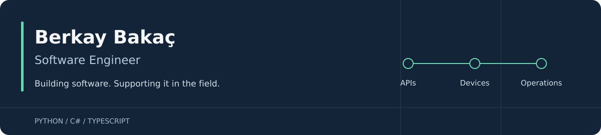

**Software Engineer | Backend & Device Integration**

I build backend services and device-connected software used in stores, restaurants, fitness locations and a school. At Statek Stabil Teknoloji, I am the sole software developer responsible for requirements, implementation, deployment and field support.

My work spans Python audio systems, C#/.NET services and TypeScript applications, including concurrent credit accounting, reconnect recovery and updates on customer machines.

Based in Türkiye. **Open to international remote, contractor and relocation opportunities.**

[Engineering case studies](case-studies.md) · [LinkedIn](https://www.linkedin.com/in/berkay-bakac/) · [Email](mailto:berkaybakacwork@gmail.com)

### In use

| Product | What I build and maintain | Deployment snapshot |
|---|---|---|
| [AnnounceFlow](https://github.com/berkaybakac/announceflow) | Scheduled announcements, live Windows-to-Pi audio and a Flask control panel | 3 customers / 3 locations |
| [SepetArası](https://github.com/berkaybakac/sepetarasi-order-tracking) | TypeScript restaurant ordering, cashier/customer displays and real-time updates | 1 restaurant |
| [VeliGeldi — case study](case-studies.md#veligeldi) | School pickup notifications and licensing/TTS services with .NET and PostgreSQL | 1 school |
| [Turnstile Device Agent — case study](case-studies.md#turnstile) | Python, vendor WebSocket integration, Raspberry Pi kiosks and GPIO control | 7 locations across 3 cities |

Deployment counts last confirmed 2026-09-08. Turnstile and VeliGeldi source code is private; the case studies describe my work without exposing private source code.

### Engineering notes

The work I enjoy most starts when software meets its operating environment: concurrent requests, interrupted connections, constrained displays and updates on customer machines.

- [Audio diagnostics and bounded recovery](case-studies.md#announceflow)
- [Making existing display hardware usable](case-studies.md#sepetarasi)
- [A credit ledger that handles concurrent requests](case-studies.md#veligeldi)
- [Connecting vendor events to physical turnstiles](case-studies.md#turnstile)

### Working stack

- **Python / Linux / Raspberry Pi:** audio scheduling, device agents and field diagnostics.
- **C#/.NET / PostgreSQL:** classroom notifications, credit accounting and licensing services.
- **TypeScript / React / Fastify:** restaurant ordering, cashier applications and real-time displays.

**Ongoing development:** Kadans, Tellal AI and a retail barcode price checker; not included in the deployment figures above.
